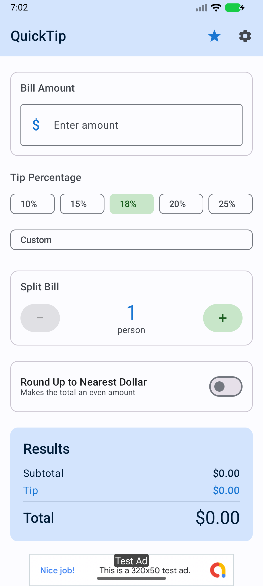

# QuickTip 💰

A smart, elegant tip calculator with country etiquette guides, bill splitting, and regional rounding. Built with Kotlin Multiplatform for Android and iOS.

[](https://play.google.com/store/apps/details?id=com.ofekyariv.quicktip)
[](LICENSE)
[](https://kotlinlang.org)
[](https://www.jetbrains.com/lp/compose-multiplatform)
[](https://github.com/ofekyariv/quicktip/releases)

---

## 📸 Screenshots

<p align="center">
  
  
</p>

---

## ✨ Features

- 💵 **Smart Tip Calculation** — Customizable tip percentages with quick presets (10%, 15%, 18%, 20%, 25%)
- 👥 **Bill Splitting** — Split bills evenly among any number of people
- 🌍 **50+ Country Tipping Guides** — Cultural etiquette and recommended ranges by service type
- 🍽️ **6 Service Types** — Restaurant, Taxi, Salon, Hotel, Delivery, Counter Service
- 🎯 **Regional Rounding** — Smart rounding based on local conventions (US: $0.50/$1.00, IL: ₪0.10, EU: €0.50, UK: £0.50)
- 📊 **Calculation History** — Review past calculations (last 5 free, unlimited with Premium)
- 💎 **Premium** — One-time $0.99 unlock for unlimited history, no banner ads, custom presets, CSV export
- 🎬 **Rewarded Ads** — Watch a 30-second ad to unlock Premium for 24 hours
- 🌓 **Dark Mode** — Full Material 3 light/dark theme support
- 🌐 **Localized** — 12 languages supported

---

## 🏗️ Architecture

Built with **Kotlin Multiplatform (KMP)** + **Compose Multiplatform** for a single shared codebase across Android and iOS.

### Project Structure

```
quicktip/
├── composeApp/
│   └── src/
│       ├── commonMain/kotlin/com/ofekyariv/quicktip/
│       │   ├── ui/               # Compose screens (Main, History, Settings, Premium)
│       │   ├── viewmodel/        # TipViewModel, HistoryViewModel
│       │   ├── data/
│       │   │   ├── models/       # TipCalculation, CountryTipInfo, ServiceType, etc.
│       │   │   ├── repository/   # CalculationRepository, SettingsRepository
│       │   │   ├── tipping/      # 50+ country tipping database
│       │   │   └── database/     # SQLDelight schema
│       │   ├── ads/              # AdManager, RemoteAdConfig, AdBannerView
│       │   ├── analytics/        # AnalyticsTracker, CrashReporter
│       │   ├── iap/              # IAPManager
│       │   └── di/               # Koin AppModule
│       ├── androidMain/          # Android-specific implementations
│       └── iosMain/              # iOS-specific implementations
├── iosApp/                       # iOS app wrapper (SwiftUI entry point)
├── store-assets/                 # Play Store / App Store graphics
├── maestro/                      # UI test flows
├── ui-tests/                     # Extended Maestro test suite
└── docs/                         # Privacy policy, Terms of Service
```

### Tech Stack

| Layer | Technology |
|---|---|
| UI | Compose Multiplatform 1.7.1 + Material 3 |
| Language | Kotlin 2.1.0 |
| Architecture | MVVM + StateFlow |
| DI | Koin |
| Database | SQLDelight |
| Preferences | DataStore |
| Ads | AdMob (banner, interstitial, rewarded) + Remote Config |
| Analytics | Firebase Analytics + Crashlytics |
| IAP | Google Play Billing + StoreKit |
| Testing | JUnit + Maestro (15 UI flows) |

---

## 🚀 Getting Started

### Prerequisites

- JDK 17+
- Android Studio (for Android)
- Xcode 15+ (for iOS, macOS only)

### Build

```bash
git clone https://github.com/ofekyariv/quicktip.git
cd quicktip

# Android
./gradlew :composeApp:assembleDebug

# iOS (macOS only)
cd iosApp && xcodebuild -workspace iosApp.xcworkspace -scheme iosApp \
  -destination 'platform=iOS Simulator,name=iPhone 15' build

# Tests
./gradlew :composeApp:testDebugUnitTest
```

---

## 🧪 Testing

15 Maestro UI flows cover the full user journey:

- Basic calculation + bill splitting
- Currency switching (USD, EUR, GBP, ILS)
- Country tipping guide lookup
- History save and retrieval
- Premium gate and IAP flow
- Settings persistence
- RTL language support
- Edge cases (zero amounts, large bills)

Run UI tests:
```bash
maestro test maestro/basic-calculation.yaml
```

---

## 💎 Premium Features

One-time **$0.99** unlock:

| Feature | Free | Premium |
|---|---|---|
| Calculation history | Last 5 | Unlimited |
| Banner ads | ✅ shown | ❌ removed |
| Custom tip presets | ❌ | ✅ |
| CSV export | ❌ | ✅ |
| Material You theming | ❌ | ✅ |
| Custom rounding rules | ❌ | ✅ |

**Alternative:** Watch a rewarded ad to unlock Premium for 24 hours.

---

## 🤝 Contributing

1. Fork the repository
2. Create a feature branch: `git checkout -b feature/my-feature`
3. Commit: `git commit -m 'Add my feature'`
4. Push: `git push origin feature/my-feature`
5. Open a Pull Request

Please follow [Kotlin Coding Conventions](https://kotlinlang.org/docs/coding-conventions.html) and include tests for new features.

---

## 📄 License

Apache License 2.0 — see [LICENSE](LICENSE) for details.

```
Copyright 2026 Ofek Yariv
```

---

## 📧 Contact

- **Issues:** [GitHub Issues](https://github.com/ofekyariv/quicktip/issues)
- **Email:** ofekyariv28@gmail.com
- **Privacy Policy:** https://ofekyariv.github.io/quicktip/privacy.html
- **Terms of Service:** https://ofekyariv.github.io/quicktip/terms.html

---

## 📊 Status

| Field | Value |
|---|---|
| Version | 1.0.1 |
| Platform | Android (API 24+), iOS (15.0+) |
| Status | ✅ Live on Google Play |
| Released | February 2026 |

---

**Built with ❤️ using Kotlin Multiplatform**
